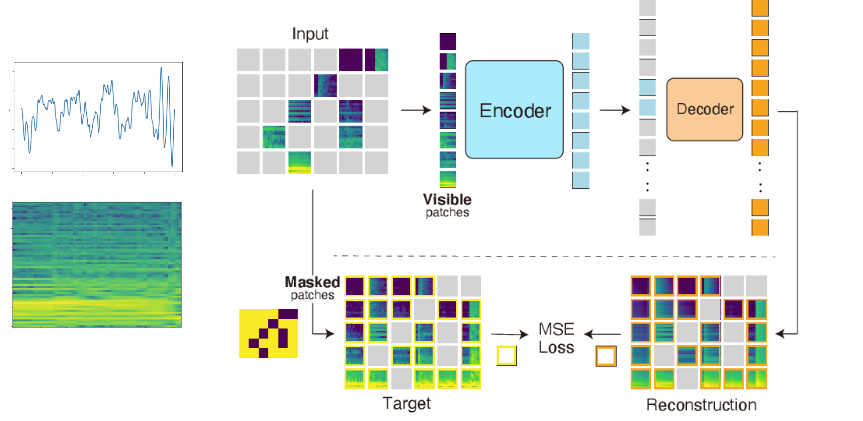

# EEG-MAE


<p align="center">
  
</p>


### 1. Installation
- This repo follows the [MAE repo](https://github.com/facebookresearch/mae), Installation and preparation follow that repo.
- Copy files and patch the timm package by ``bash timm_patch.sh'' (Please change the path to your own timm package path). We use timm==0.3.2, for which a [fix](https://github.com/rwightman/pytorch-image-models/issues/420#issuecomment-776459842) is needed to work with PyTorch 1.8.1+.
- Please find [mae_env.yml](./mae_env.yml) for all the dependencies.
- You may also use download the conda-packed [conda env](https://drive.google.com/file/d/1ECVmVyscVqmhI7OQa0nghIsWVaZhZx3q/view?usp=sharing), untar it, and then:
```
source path_to_env/bin/activate
```

### 2. Prepare data:


### 3. Pretrianing 

### 4. Fine-tuning


You can also try fine-tuning on AudioSet-20K for 60 epochs with

### Updates
- [x] Code and Model Release
- [x] Provide conda-pack envs
- [ ] Notebook demos for reconstruction (legal blocked)
- [ ] Additional exps

### Citation


### Contact
Please contact Jimmy Pulido Arias (jiapulidoar@gmail.com) if you have any questions. Thank you.

### Reference
The codebase is based on the awesome [MAE](https://github.com/facebookresearch/mae) and [AST](https://github.com/YuanGongND/ast) repos.

### License
This project is under the CC-BY 4.0 license. See [LICENSE](LICENSE) for details.
